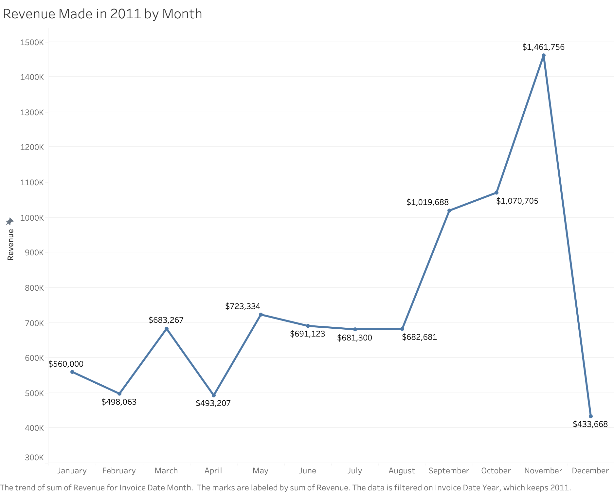
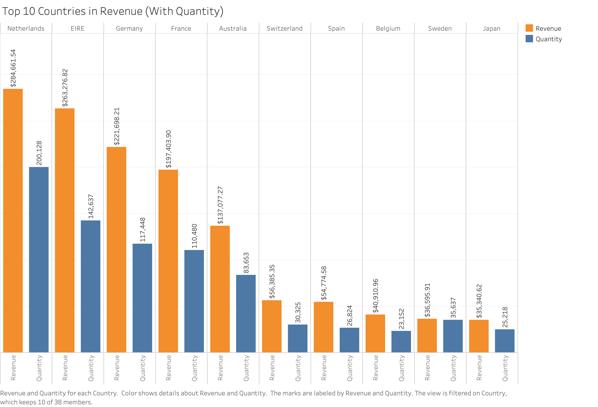
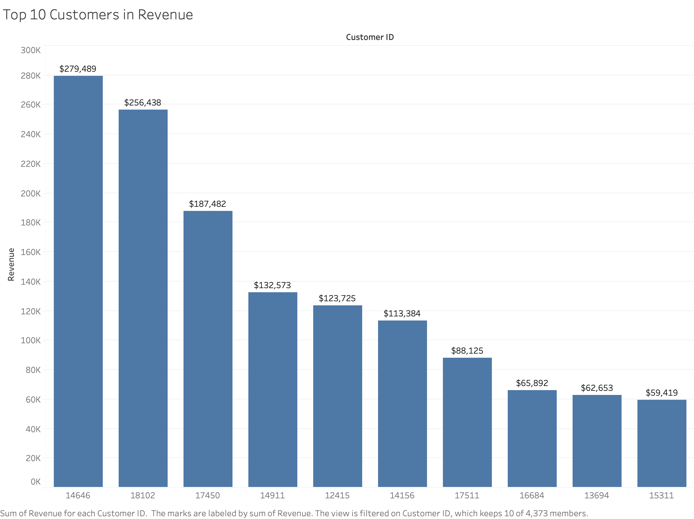
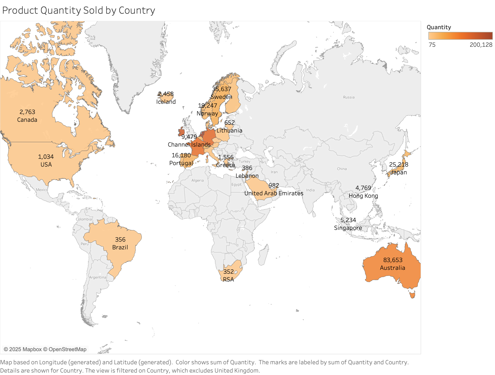
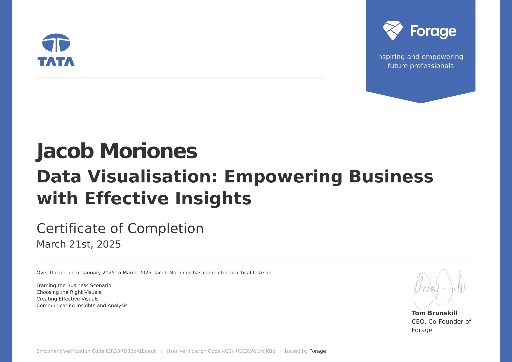

<h1>Forage Job Simulation: Empowering Business with Effective Insights - <a href="https://www.theforage.com/simulations/tata/data-visualisation-p5xo?reloaded=true" download>Simulation Link</a> </h1>

<h2>Description</h2>
I completed the Tata Data Visualisation job simulation through Forage, where I acted as a data consultant tasked with delivering insights to executive stakeholders. The experience involved cleaning and analyzing sales data, identifying seasonal trends, top customers, and high-potential international markets. I created a clear, actionable dashboard and presented findings in a concise, business-focused manner. This project sharpened my skills in data storytelling, Tableau, and executive communication while reinforcing the value of aligning visuals with decision-making needs. 
 

<h2>Languages and Utilities Used</h2>

- <b>Tableau</b> 

 

<h2>Visualizations Created:</h2>
<table style="width: 100%;">
  <!-- Row 1: Images -->
  <tr>
    <td align="center" valign="top" style="width: 50%;">
      
    </td>
    <td align="center" valign="top" style="width: 50%;">
      
    </td>
  </tr>
  <table style="width: 100%;">
  <!-- Row 1: Images -->
  <tr>
    <td align="center" valign="top" style="width: 50%;">
      
    </td>
    <td align="center" valign="top" style="width: 50%;">
      
    </td>
  </tr>
</table>
 
<h2>Certificate:</h2>
 

  
